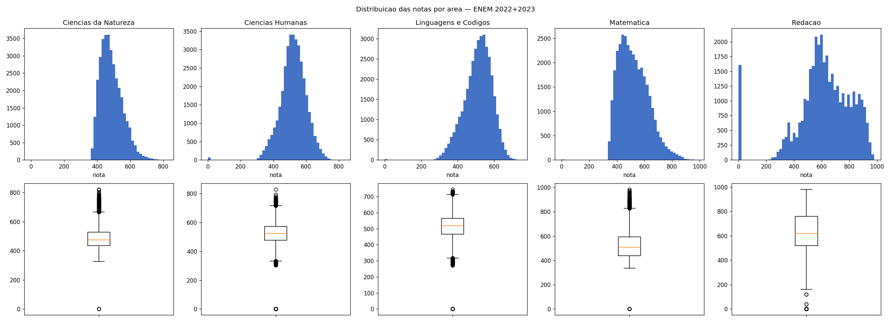
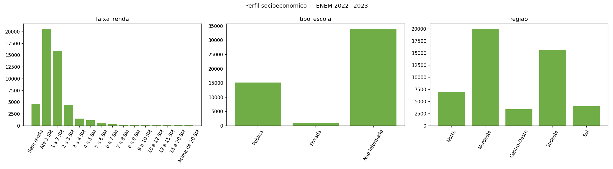
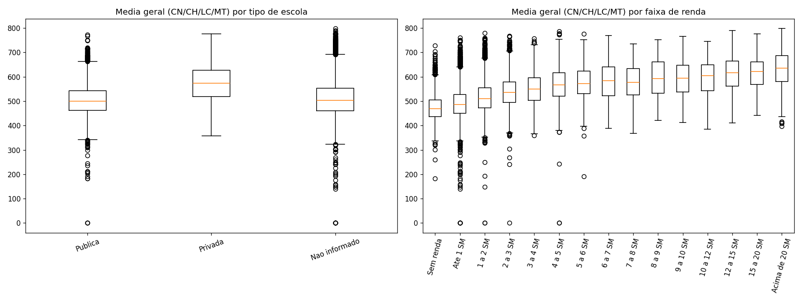
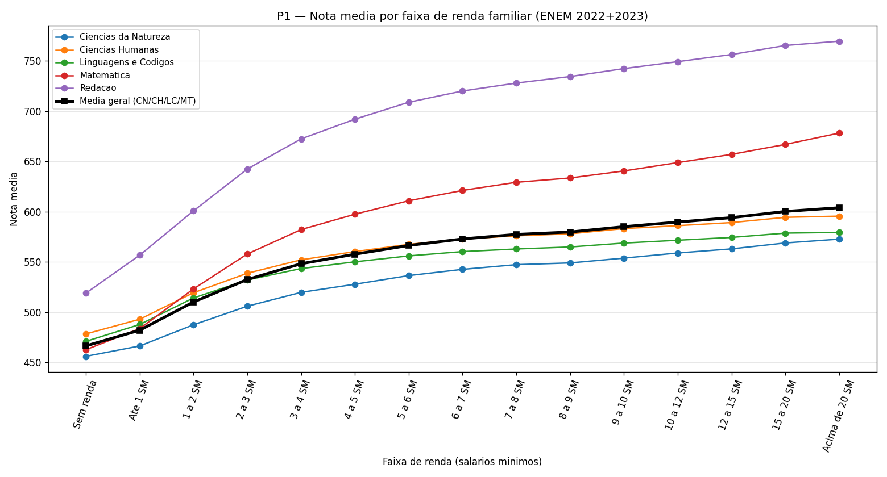
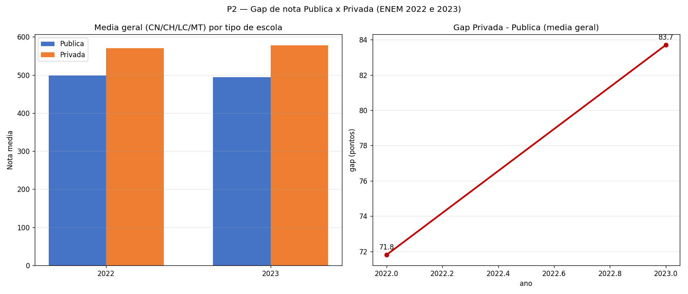
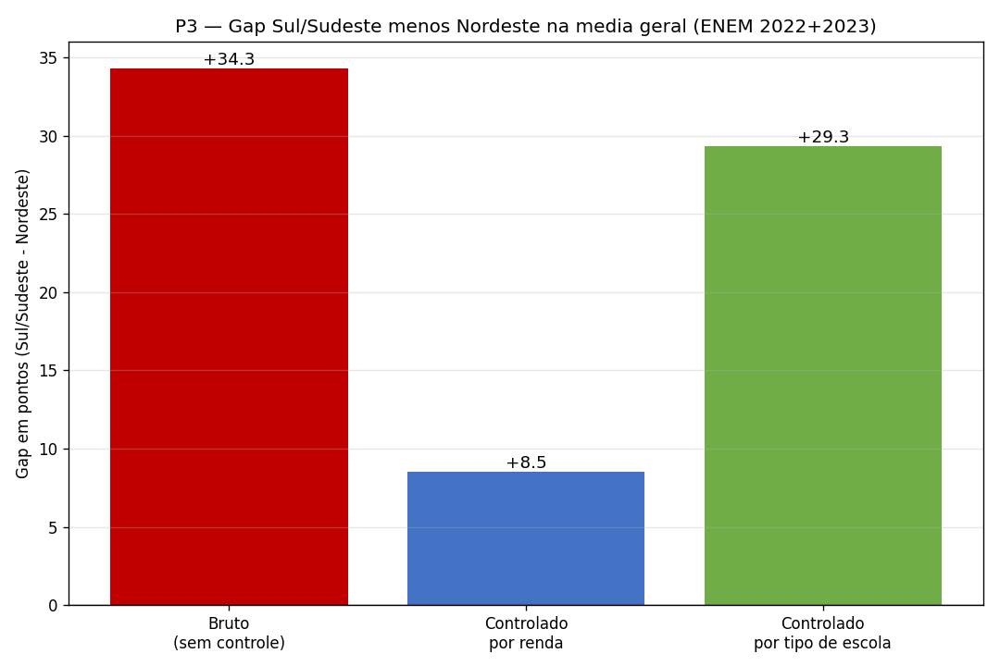
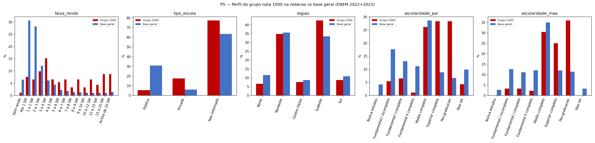

# Relatório Técnico — Desigualdade Socioeconômica e Desempenho no ENEM (2022–2023)

**Disciplina:** Análise de Dados · UFPB · 2026
**Equipe:** Augusto Blois · Pedro Flávio
**Fonte dos dados:** Microdados do ENEM 2022 e 2023 — INEP (público, sem autenticação)
**Base analítica:** `data/processado/enem_2022_2023.parquet` — **7.410.060 linhas** (2022 + 2023 concatenados, com marcador `ano`)

> **Pendente de revisão humana (US-11):** este `.md` foi gerado a partir dos *runs* na BASE INTEIRA
> (sem amostragem) e da síntese fiel dos documentos de governança. A dupla deve: (1) conferir a seção
> do achado 2024 contra a fonte primária (`Leia_Me_Enem_2024.pdf`); (2) revisar tom e fechamento das
> conclusões; (3) exportar o PDF (comando ao final). **Nenhum checkbox do `TASKS.md` foi marcado** —
> isso é ato da revisão da dupla / do *gate*.

---

## 1. Pipeline de dados (carga → tratamento → integração)

O pipeline transforma os CSV brutos do INEP (~1,7 GB/edição) numa única base analítica tipada e
reproduzível. Três etapas, cada uma num módulo de `src/enem/`:

### 1.1 Carga eficiente e tipada (`carga.py` — US-01)

Leitura com `usecols` + `dtype` por coluna: **14 colunas** relevantes carregadas (das centenas do
CSV original), categóricas como `category` e as 5 notas como `float32` (decisão de memória, RNF-02,
não de tratamento). Isso mantém o uso de memória administrável sem perder a informação das perguntas
de pesquisa. As colunas: `NU_INSCRICAO`, `NU_ANO`, as 5 notas (`NU_NOTA_CN/CH/LC/MT/REDACAO`),
`Q006` (renda), `Q001`/`Q002` (escolaridade do pai/mãe), `TP_ESCOLA`, `TP_COR_RACA`, `TP_SEXO`,
`SG_UF_PROVA`.

### 1.2 Tratamento e recodificação (`tratamento.py` — US-02)

Quatro variáveis socioeconômicas foram recodificadas de códigos-letra do INEP para rótulos legíveis e
**ordinais**, preservando a ordem real do dicionário oficial (conferido nos `.xlsx` reais de 2022 e
2023, não de memória):

- **`faixa_renda`** (de `Q006`): 15 faixas ordinais de "Sem renda" a "Acima de 20 SM". A recodificação
  é feita pela faixa em **salários mínimos**, não pelo valor em R$ — porque o salário mínimo de
  referência mudou entre as edições (R$ 1.212,00 em 2022; R$ 1.320,00 em 2023). Recodificar por SM
  mantém a categoria comparável ao concatenar as duas edições.
- **`escolaridade_pai`** / **`escolaridade_mae`** (de `Q001`/`Q002`): escala ordinal de "Nunca estudou"
  a "Pós-graduação", com "Não sei" mantido como categoria fora da escala (ao final).
- **`tipo_escola`** (de `TP_ESCOLA`): `Publica`, `Privada`, `Nao informado`. O código `1` do INEP
  ("Não Respondeu") é recodificado para `Nao informado` como categoria **explícita** — nunca dropado
  nem fundido com pública/privada.

**Tratamento de nulos:** as notas mantêm `NaN` (ausência legítima — candidato ausente/eliminado, ~24–28%
por área); **nenhuma imputação**, pois imputar distorceria médias e distribuições. As variáveis SES
recodificadas têm 0 `NaN` (o "não informado" já é categoria explícita do próprio domínio do INEP).

### 1.3 Integração 2022 + 2023 (`tratamento.py` — US-02)

As duas edições foram concatenadas numa única base com coluna `ano` (categoria ordenada `[2022, 2023]`),
persistida em **parquet** fora do versionamento. Resultado: **7.410.060 linhas**. A documentação completa
de cada coluna (origem, tipo, regra de nulos, justificativa) está em `docs/dicionario-base.md` (US-03).

> **Limitação de cobertura medida na base cheia (não no dicionário):** `tipo_escola` = `Nao informado`
> em **63,3%** das linhas (2.271.895 `Publica` = 30,7%; 446.824 `Privada` = 6,0%; 4.691.341 `Nao informado`
> = 63,3%). O candidato médio do ENEM **não respondeu** essa pergunta do questionário — não é bug, é o
> próprio dado do INEP. Toda comparação pública × privada (P2) roda sobre o `N` útil de ~37% da base e
> declara esse `N`.

### 1.4 Visão exploratória da base



*Figura 1. Histograma e boxplot das 5 notas (CN, CH, LC, MT, Redação) na base 2022+2023. As 4 áreas
cognitivas são aproximadamente contínuas; a Redação tem distribuição mais discreta (pontuação em
múltiplos de 20). NaN (candidato ausente/eliminado) excluído do cálculo pontual, não imputado.*



*Figura 2. Distribuição das variáveis socioeconômicas (faixa de renda, tipo de escola, macrorregião)
na base. Evidencia a concentração em faixas de renda baixas e a massa de `Nao informado` em
`tipo_escola`.*



*Figura 3. Comparação exploratória de grupos (US-04) — primeira evidência visual de que os grupos
socioeconômicos diferem em desempenho, detalhada nas perguntas P1–P5.*

---

## 2. Resultados das perguntas analíticas (P1–P5)

> **Medida de desempenho:** salvo indicação, "média geral" = média das 4 áreas cognitivas
> (CN/CH/LC/MT), sem a redação — uma medida única e comparável entre todas as perguntas. Todas as
> médias usam `skipna` (NaN das notas não é imputado). **Todos os achados abaixo são de ASSOCIAÇÃO,
> nunca de causalidade** (ver §6).

### 2.1 P1 — Renda familiar × nota média

**Achado:** relação **positiva e monotônica** entre faixa de renda e desempenho, confirmando a hipótese.

- **Spearman ρ = +0,463** (p ≈ 0; **N = 5.340.820 pares** com renda e nota válidas) — correlação
  positiva moderada, apropriada à natureza ordinal da renda.
- **Gap topo–base = 137,6 pontos** na média geral: "Acima de 20 SM" = **603,9** vs. "Sem renda" = **466,3**.
- A nota sobe de forma consistente faixa a faixa nas 5 áreas; o efeito é mais acentuado em Matemática
  (de 462,5 para 678,2 entre extremos).



*Figura 4. Nota média por área e média geral ao longo das faixas de renda (ordinais). Cada linha é uma
área; a linha preta grossa é a média geral. A monotonicidade ascendente é visível em todas as áreas.
N = 7.410.060 linhas; ρ de Spearman = +0,463 (N = 5.340.820 pares).*

### 2.2 P2 — Gap escola pública × privada e variação 2022→2023

**Achado:** privada > pública em todos os anos; o gap **cresceu** de 2022 para 2023.

| Ano | Média Pública | Média Privada | Gap (Priv.−Púb.) | N pública | N privada |
|---|---|---|---|---|---|
| 2022 | 498,6 | 570,4 | **71,8** | 1.105.355 | 212.205 |
| 2023 | 493,8 | 577,5 | **83,7** | 1.166.540 | 234.619 |

- **Variação do gap 2022→2023 = +11,9 pts** (cresceu). O movimento vem de ambos os lados: a média
  pública **caiu** (498,6 → 493,8) enquanto a privada **subiu** (570,4 → 577,5).
- O gap de 2023 (83,7) entra na faixa esperada pela hipótese (~80–120 pts); o de 2022 (71,8) fica
  logo abaixo.
- `N` útil da comparação = pública + privada apenas (~37% da base; `Nao informado` fica fora do gap).



*Figura 5. Esquerda: média geral por tipo de escola, por ano. Direita: o gap Privada−Pública sobe de
71,8 (2022) para 83,7 (2023). `Nao informado` (63,3% da base) excluído do gap.*

### 2.3 P3 — Disparidade regional, controlando renda e tipo de escola

**Achado:** existe vantagem bruta de Sul/Sudeste sobre o Nordeste; estratificar por renda e por escola
**reduz** o gap mas **não o elimina** — sobra um resíduo regional.

- **Gap bruto Sul/Sudeste − Nordeste = +34,3 pts** (Nordeste = 502,8; Sul/Sudeste = 537,2; detalhe:
  Sudeste = 538,5, Sul = 533,1).
- **Controlado por faixa de renda = +8,5 pts** (redução de ~75% do gap bruto).
- **Controlado por tipo de escola = +29,3 pts** (redução de ~14%).
- Leitura: boa parte da disparidade regional bruta é **composição** (o Nordeste tem mais candidatos de
  renda baixa), mas mesmo dentro da mesma faixa de renda e do mesmo tipo de escola o Sul/Sudeste
  mantém vantagem. **Ressalva forte:** estratificar não isola confundidores (infraestrutura municipal,
  qualidade docente, acesso à internet) — o resíduo é **associação regional**, não efeito causal.



*Figura 6. Gap Sul/Sudeste − Nordeste na média geral: bruto (+34,3), controlado por renda (+8,5),
controlado por tipo de escola (+29,3). O controle por renda absorve a maior parte do gap, mas nenhum
controle o zera.*

### 2.4 P5 — Perfil socioeconômico das notas 1000 na redação

**Achado:** o grupo que tira 1000 na redação é **fortemente concentrado** em renda alta, escola privada
e pais com ensino superior/pós — mais que a base geral.

- **N do grupo-1000 = 92 candidatos** (0,0012% da base geral de 7.410.060). **N pequeno — toda leitura
  é de proporção, com a ressalva amostral explícita.**
- **Escola privada:** 17,4% do grupo-1000 vs. 6,0% da base geral (**+11,4 p.p.**).
- **Escolaridade do pai = Pós-graduação:** 28,3% vs. 6,6% (**+21,7 p.p.**); Superior completo 28,3% vs. 8,8%.
- **Escolaridade da mãe = Pós-graduação:** 35,9% vs. 11,4% (**+24,5 p.p.**).
- **Renda:** faixas de 3 SM para cima são sobrerrepresentadas; a faixa "3 a 4 SM" é a de maior
  sobrerrepresentação (+9,1 p.p.), e "15 a 20 SM"/"Acima de 20 SM" aparecem ~8,7% cada (vs. ~1% na base).
- O grupo é **menos diverso** socioeconomicamente do que o esperado por acaso — o mesmo perfil de
  vantagem de P1/P2.



*Figura 7. Barras lado a lado (% no grupo-1000 vs. % na base geral) por faixa de renda, tipo de escola,
região e escolaridade dos pais. A sobrerrepresentação de renda alta, escola privada e pais com
pós-graduação é o achado central. N grupo-1000 = 92.*

---

## 3. Modelo preditivo interpretável (P4)

**Objetivo:** não prever a nota, mas **ranquear os fatores socioeconômicos** que mais se associam ao
desempenho. **Alvo (y)** = média geral das 4 áreas cognitivas (a mesma de P1–P3). **Preditores (X)**:
`faixa_renda`, `tipo_escola`, `escolaridade_pai`, `escolaridade_mae`, `TP_COR_RACA`, `regiao`, `ano`.
**Modelo:** regressão linear com *one-hot encoding* (`drop_first`) de todas as categóricas — escolha
deliberada de interpretabilidade (cada coeficiente lê-se como o efeito da categoria frente à
referência, sem impor linearidade entre faixas).

**Treino na base inteira** (não amostra): 5.340.820 linhas após dropar `y` NaN (nunca imputado),
split 80/20 com `random_state=42`, 40 colunas one-hot.

| Métrica | Valor (base cheia) |
|---|---|
| **R² (teste)** | **0,2677** |
| **MAE (teste)** | **52,46 pontos** |
| N teste | 1.068.164 |

**Ranking de variáveis por contribuição** (soma dos `|coef|` das categorias de cada grupo):

| Variável | Soma \|coef\| | Leitura |
|---|---|---|
| **faixa_renda** | **856,39** | driver dominante, muito à frente das demais |
| escolaridade_mae | 123,26 | capital cultural materno |
| escolaridade_pai | 108,94 | capital cultural paterno |
| regiao | 64,87 | desigualdade geográfica estrutural |
| TP_COR_RACA | 60,62 | eixo de desigualdade racial |
| tipo_escola | 43,70 | rede pública/privada |
| ano | 1,16 | controle temporal (efeito quase nulo) |

**Conclusão de P4:** a renda familiar é, isoladamente, o preditor socioeconômico dominante do
desempenho, seguida pela escolaridade dos pais (mãe ligeiramente à frente do pai). Região e
raça/cor vêm depois; `tipo_escola` contribui pouco no modelo multivariado — coerente com o fato de
o gap de P2 ser em boa parte **mediado pela renda** (escola privada correlaciona com renda alta, e a
renda já está no modelo). O R² = 0,27 indica que os fatores SES aqui medidos explicam **uma fração
modesta** da variância: o desempenho depende fortemente de fatores não capturados (trajetória escolar
individual, preparo específico, fatores cognitivos/psicológicos). Um R² baixo **não invalida** o
modelo — apenas delimita honestamente o que o SES explica.

> **Nota de reprodutibilidade:** uma execução anterior em amostra de 200 mil linhas registrou
> R² = 0,267 e MAE = 48,45, com `tipo_escola` na última posição do ranking. Os números **definitivos**
> deste relatório são os da **base cheia** (R² = 0,2677; MAE = 52,46; N teste = 1.068.164). A ordem
> do ranking se mantém com renda dominante; na base cheia `escolaridade_mae` supera `escolaridade_pai`
> e `tipo_escola` cai abaixo de `regiao`/`TP_COR_RACA`. O MAE maior na base cheia (52,5 vs. 48,5) é
> esperado: a amostra de 200k subestimava o erro de generalização.

---

## 4. Achado de governança: a quebra de linkage do ENEM 2024

> Síntese fiel de `docs/achado-governanca-2024.md` (US-17) e `docs/perguntas-2024-teto-temporal.md`
> (US-18). **Fonte primária:** INEP, *Microdados do Enem 2024 — LEIA-ME*, jun/2025
> (`data/microdados_enem_2024/.../Leia_Me_Enem_2024.pdf`). **Esta seção deve ser conferida pela dupla
> contra essa fonte (US-11 / US-17 pendente de revisão cruzada).**

### 4.1 O que mudou: duas bases sem chave comum

Até 2023, perfil socioeconômico e nota do **mesmo indivíduo** conviviam numa estrutura única de
microdados por participante, permitindo parear perfil ↔ nota diretamente. A partir de **2024 o INEP
dividiu a base em duas** (LEIA-ME, p.7):

- **`PARTICIPANTES_2024`** — informações gerais + **questionário socioeconômico** (renda, escolaridade
  dos pais, etc.).
- **`RESULTADOS_2024`** — **escola** de conclusão, provas, gabaritos e **proficiências (notas)**.

O documento afirma textualmente que *"as duas bases não possuem chave de ligação em comum"*, de modo
deliberado, *"em fiel observância ao que estabelece a Lei Geral de Proteção de Dados Pessoais (LGPD)"*
(LEIA-ME, p.7). A base legal é a **LGPD — Lei nº 13.709, de 14 de agosto de 2018** (LEIA-ME, p.4): o
INEP afirma ter-se visto obrigado a mudar o modelo de microdados em razão dela e "optou pela cautela".
A ausência de chave é, portanto, **escolha declarada do INEP**, não defeito de empacotamento.
*(Nota factual: o LEIA-ME não cita resolução nem manifestação específica da ANPD — atribui a mudança à
LGPD e à cautela do próprio INEP.)*

### 4.2 Quais perguntas morrem e quais sobrevivem em 2024+

O critério é mecânico: **uma pergunta sobrevive se, e somente se, a variável de corte E a nota vivem na
mesma base em 2024.** Como a nota está em `RESULTADOS`, sobrevivem só os cruzamentos cuja variável de
corte também está em `RESULTADOS`.

| Pergunta | Cruza | 2024+ | Razão |
|---|---|---|---|
| **P1** — renda × nota | renda × nota | **MORRE** | renda em PARTICIPANTES, nota em RESULTADOS — bases separadas, sem chave |
| **P4** — preditores SES da nota | SES × nota | **MORRE** | preditores em PARTICIPANTES, alvo em RESULTADOS |
| **P5** — perfil SES das notas 1000 | nota → perfil SES | **MORRE** | nota em RESULTADOS, perfil em PARTICIPANTES |
| **P2** — escola pública × privada | tipo de escola × nota | **SOBREVIVE** | **ambos em RESULTADOS** |
| **P3** — disparidade regional | UF/região × nota | **SOBREVIVE** | **ambos em RESULTADOS** |
| raça × nota | `TP_COR_RACA` × nota | **MORRE** *(inferido)* | raça é atributo do questionário do participante → PARTICIPANTES |
| sexo × nota | `TP_SEXO` × nota | **MORRE** *(inferido)* | mesmo raciocínio |

> **Ressalva honesta (US-18 §2.1):** a classificação "MORRE" de raça×nota e sexo×nota é **inferência
> fundamentada**, não citação literal — o LEIA-ME não lista nominalmente em qual base ficam
> `TP_COR_RACA`/`TP_SEXO`. Caso estejam replicadas em `RESULTADOS_2024`, esses cruzamentos passariam a
> sobreviver. A incerteza é declarada, não mascarada.

### 4.3 O teto temporal 2023

O núcleo SES↔nota do projeto (P1, P4, P5) depende inteiramente de parear, no mesmo indivíduo, uma
variável do questionário com a nota — propriedade que existe de 2009 a 2023 e que a edição 2024 rompe.
Consequência direta: **2023 é a última edição em que o núcleo P1/P4/P5 é respondível com os microdados
públicos.** O teto 2023 não é escolha arbitrária de escopo: é a fronteira de respondibilidade da base.
Por isso o pipeline analítico usa 2022–2023, e os eixos que sobrevivem (P2/P3 via `RESULTADOS`) são os
únicos elegíveis para o módulo vivo (EP-07), que ingere edições novas sem reprocessar o núcleo SES.

---

## 5. Conclusões

1. **A desigualdade socioeconômica é nítida e consistente.** Renda (P1), tipo de escola (P2),
   região (P3) e o perfil das notas máximas (P5) apontam todos na mesma direção: vantagem de desempenho
   concentrada nos estratos de renda alta, escola privada e Sul/Sudeste.
2. **A renda é o eixo dominante.** O modelo (P4) confirma a renda muito à frente de qualquer outro fator
   SES, com a escolaridade dos pais em segundo plano. Boa parte do gap de escola (P2) e do gap regional
   bruto (P3) se reduz quando se controla pela renda — sinal de que renda é o fator estrutural por trás
   dos demais.
3. **A disparidade regional tem um resíduo próprio.** Mesmo controlando renda e escola, o Sul/Sudeste
   mantém vantagem (+8,5 pts dentro da mesma faixa de renda) — apontando fatores estruturais regionais
   não capturados pelas variáveis disponíveis.
4. **O topo é socialmente seletivo.** As 92 notas 1000 na redação concentram-se em pais com
   pós-graduação e escola privada muito acima da base — a excelência reflete a mesma vantagem
   socioeconômica das médias.
5. **A base mudou de natureza em 2024.** A quebra de linkage do INEP torna o eixo central (SES↔nota)
   estruturalmente irrespondível a partir de 2024, fixando 2023 como teto temporal da análise.

---

## 6. Limitações (obrigatórias)

1. **Associação, não causalidade.** *Todos* os achados de P1–P5 e os coeficientes do modelo (P4) são
   **correlações**, não efeitos causais. Renda, escola, região e raça são fortemente correlacionadas
   entre si; nenhuma análise aqui isola o efeito causal de uma variável. Estratificar (P3) ou colocar
   tudo num modelo (P4) **não elimina confundidores** não observados (qualidade docente, infraestrutura,
   acesso à internet, trajetória individual).
2. **R² baixo (0,27).** O modelo P4 explica apenas ~27% da variância da nota média. Os fatores SES aqui
   medidos são parte da história, não a história inteira — o desempenho depende fortemente de fatores
   não capturados (preparo individual, trajetória escolar, fatores cognitivos/psicológicos). O R² baixo
   delimita o alcance das conclusões, não as invalida.
3. **Teto temporal 2023.** Não é "dados antigos": é uma **fronteira de respondibilidade**. A quebra de
   linkage do ENEM 2024 (§4) torna P1/P4/P5 estruturalmente irrespondíveis a partir de 2024. Os achados
   valem para 2022–2023; sua extrapolação para edições futuras é, no núcleo SES, impossível com os
   microdados públicos.
4. **Cobertura de `tipo_escola`.** 63,3% da base é `Nao informado`; o gap de P2 roda sobre ~37% da base
   (pública + privada). O `N` reduzido está declarado, mas a comparação não cobre o candidato médio,
   que não respondeu essa pergunta.
5. **N pequeno em P5.** Apenas 92 candidatos com 1000 na redação. As proporções são indicativas e
   sensíveis a poucos casos — leitura qualitativa, não inferência fina.
6. **Incerteza declarada sobre raça/sexo em 2024+** (§4.2): classificação "MORRE" por inferência, não
   por citação literal do LEIA-ME.

---

## Apêndice — Reprodutibilidade dos números

Todos os números deste relatório vêm de execuções na **base inteira** (`data/processado/enem_2022_2023.parquet`,
7.410.060 linhas), via:

```powershell
python -m src.enem.p1_renda
python -m src.enem.p2_escola
python -m src.enem.p3_regiao
python -m src.enem.p5_redacao1000
python -m src.enem.modelo
```

Cada módulo imprime a validação no stdout e regenera sua figura em `docs/figuras/`. As figuras deste
relatório foram regeradas nessas execuções.

### Exportação para PDF (pendente — ato humano)

Comando sugerido (rodar de dentro de `docs/` para os caminhos relativos das figuras resolverem):

```powershell
cd docs
pandoc relatorio-tecnico.md -o relatorio-tecnico.pdf --pdf-engine=xelatex -V geometry:margin=2cm
```

Se `pandoc` ou um *engine* LaTeX (xelatex/wkhtmltopdf) não estiver instalado, o `.md` já está pronto e
o comando acima fica registrado para a dupla executar na revisão final.
